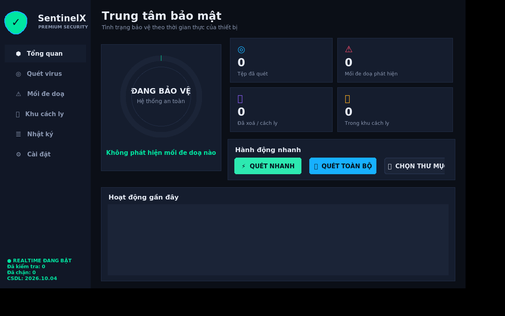

# 🛡️ SentinelX Antivirus 2.0 — Premium Security Suite

Phần mềm diệt virus cho **Windows** (chạy được cả Linux/macOS), **engine C++17 đa luồng** + **GUI Python (Tkinter)** giao diện tối cao cấp. Tự động quét, **phát hiện là xử lý ngay lập tức** (xoá vĩnh viễn hoặc cách ly mã hoá).



## 🚀 Chạy nhanh trên Windows
```bat
run.bat          :: tự build DLL (nếu có g++/MSVC) rồi mở GUI
```
hoặc thủ công:
```bat
cd core && build.bat && cd ..
python app\main.py
```
> Không có trình biên dịch C++? Vẫn chạy được — app tự chuyển sang **engine Python fallback** (chậm hơn, đủ tính năng).
> Nên chạy **Run as Administrator** để quét/xoá được file hệ thống.

Linux/macOS: `cd core && make && cd .. && python3 app/main.py`

## 📦 Đóng gói thành file .EXE
```bat
build_exe.bat            :: 1 lệnh: build DLL C++ -> PyInstaller -> dist\SentinelX.exe
```
Kết quả: **`dist\SentinelX.exe`** — một file duy nhất (~12–25 MB), **không cần cài Python**, có:
- icon `assets/sentinelx.ico`, thông tin phiên bản (`version_info.txt`)
- `console=False` (không cửa sổ đen), **`uac_admin=True`** → tự xin quyền Administrator khi mở
- DLL engine C++ + CSDL chữ ký **nhúng sẵn** bên trong; lần chạy đầu tự tạo `data/ logs/ quarantine/` **cạnh file exe**

Không có Windows/trình biên dịch? Đẩy code lên GitHub, workflow **`.github/workflows/build-windows.yml`** sẽ tự build `SentinelX.exe` trên `windows-latest` và cho tải về ở mục *Artifacts*.

**Tạo bộ cài đặt** (Start Menu + shortcut Desktop + tuỳ chọn khởi động cùng Windows):
```bat
iscc installer.iss       :: cần Inno Setup 6  ->  SentinelX_Setup.exe
```
> ⚠️ Vì exe thao tác xoá/ghi đè file, một số AV khác có thể cảnh báo *false positive* — hãy thêm ngoại lệ hoặc ký số (code signing) nếu phát hành rộng rãi.

## 🧩 Kiến trúc
```
core/engine.cpp        Engine C++17 → sentinelx_core.dll / libsentinelx_core.so (C ABI)
app/engine_bridge.py   ctypes binding + fallback thuần Python
app/core_services.py   Config · Logger · Quarantine · Remediator · RealtimeGuard
app/main.py            GUI Tkinter (dashboard, quét, đe doạ, cách ly, log, cài đặt)
app/cli.py             Quét bằng dòng lệnh
data/signatures.json   CSDL chữ ký (hash SHA-256 + mẫu ASCII/HEX)
quarantine/ logs/      Khu cách ly (mã hoá XOR) & nhật ký
```

## ⚙️ Engine C++ có gì
- **SHA-256 tự cài đặt** (không phụ thuộc thư viện ngoài) + đối chiếu hash CSDL
- **Boyer–Moore–Horspool** tìm mẫu nhị phân/ASCII cực nhanh
- **Thread pool** + `recursive_directory_iterator`, hàng đợi kết quả thread-safe
- **Heuristic**: entropy Shannon (phát hiện file PE bị pack/mã hoá), chuỗi nguy hiểm
  (`powershell -enc`, `vssadmin delete shadows`, `CreateRemoteThread`, `eval(atob(`…),
  bẫy **double extension** (`hoadon.pdf.exe`), đuôi hiếm `.scr/.pif/.hta`
- Chấm điểm: ≥60 → **INFECTED**, 35–59 → **SUSPICIOUS**
- Allow-list theo SHA-256, giới hạn dung lượng file, dừng quét tức thời

## 🖥️ Tính năng GUI
| Mục | Mô tả |
|---|---|
| Tổng quan | Vòng tròn trạng thái động, 4 thẻ thống kê, hành động nhanh, hoạt động gần đây |
| Quét virus | Quét **Nhanh / Toàn bộ ổ đĩa / Tuỳ chọn thư mục**, tốc độ tệp/giây, bảng kết quả màu |
| Mối đe doạ | Báo cáo chi tiết: kết luận, mức nguy hiểm, SHA-256, hành động đã thực hiện |
| Khu cách ly | Phục hồi / xoá vĩnh viễn / dọn sạch |
| Nhật ký | Log thời gian thực, tự xoay vòng 4 MB |
| Cài đặt | Realtime, tự động xử lý, heuristic, âm báo, chế độ xoá/cách ly, số luồng, dung lượng tối đa, thư mục giám sát |

## 🔒 Cơ chế xử lý
- **Cách ly (mặc định, an toàn)**: file bị **XOR bằng khoá ngẫu nhiên 256-bit**, đổi tên `.sxq`, gỡ khỏi vị trí gốc → mất khả năng thực thi nhưng **phục hồi được**.
- **Xoá ngay lập tức**: ghi đè dữ liệu ngẫu nhiên (chống khôi phục) rồi xoá.
- **Realtime Guard**: quét file mới/thay đổi trong Downloads, Desktop, Documents, %TEMP%… mỗi 2 giây và chặn tức thì.

## 🧪 Kiểm thử an toàn
```bat
echo X5O!P%@AP[4\PZX54(P^)7CC)7}$EICAR-STANDARD-ANTIVIRUS-TEST-FILE!$H+H* > %USERPROFILE%\Downloads\eicar.com
```
File EICAR là **file thử nghiệm chuẩn quốc tế, hoàn toàn vô hại** — SentinelX sẽ phát hiện và xử lý ngay.

## 💻 CLI
```bash
python app/cli.py C:\Users\me\Downloads --delete
```

## ⚠️ Lưu ý
Đây là sản phẩm kỹ thuật/giáo dục, **không thay thế** Windows Defender/Kaspersky… CSDL chữ ký chỉ gồm mẫu minh hoạ; hãy bổ sung hash vào `data/signatures.json` để mở rộng. Heuristic có thể báo nhầm — ưu tiên chế độ **Cách ly** thay vì Xoá.
